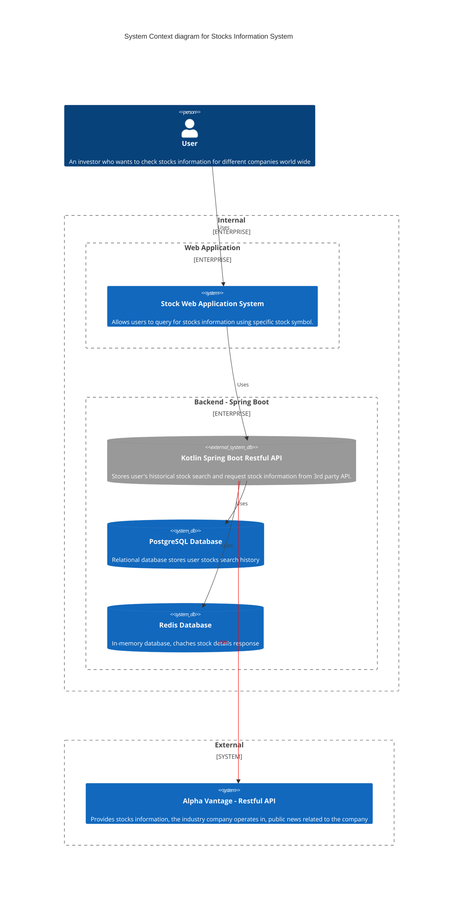

# IU Project Java and Web Development

This project objective is to build a responsive web application which display Stock information. It communicates with a backend that uses a 3rd party API called [Alpha Vantage API](https://www.alphavantage.co/) to retrieve Stock data and caches the result to avoid abusing 3rd party API limits.

## Contents

1. [Technology Used](#technology-used)
    1. [Frontend](#frontend)
    2. [Backend](#backend)
2. [How to Run this Project](#how-to-run-this-project)
    1. [Step 1: Spin-up Backend Service](#step-1-spin-up-backend-service)
    2. [Step 2: Spin-up Frontend Application](#step-2-spin-up-frontend-application)
3. [Software Architecture](#software-architecture)
    1. [Backend Architecture](#backends-architecture)
    2. [Frontend Architecture](#frontends-architecture)
4. [System Architecture and Context C4 Diagram](#system-architecture-and-context-c4-diagram)

## Technology Used

### Frontend

* NodeJs v22
* React: v18

Full list of dependencies available at [package.json => dependencies](./services/user-interface/package.json)

### Backend

* Kotlin
* OpenJDK 17
* Spring Boot
* Postgres
* Redis
* Docker

## How to Run this Project

### Step 1: Spin-up Backend Service

1. You must have installed docker with docker-compose. See [Download Docker Desktop](https://www.docker.com/) for more information
2. Using a terminal, go to the folder `cd ./docker` and start basic infrastructure by runing `docker-compose up -d`
3. Request a Alpha Vantage API key at: https://www.alphavantage.co/support/#api-key
4. Input your api key at `./services/stocks_backend/src/main/resources/application.properties` at `alpha-vantage.api-key=<YOUR_API_KEY>`
5. Using a terminal, go to the backend folder `cd ./services/stocks_backend` and build and start the application by runing `./gradlew bootRun`
6. The backend API application should be available at `http://localhost:8080`

### Step 2: Spin-up Frontend Application

1. Install [NodeJs](https://nodejs.org/en)
2. Go to the frontend application folder `cd ./services/user-interface`
3. install all packages dependencies `npm install --force`
4. Create `.env` file by copying the `.env-sample` available at user-interface's root directory
5. start local web server: `npm run start`
6. the UI interface should be available at: `http://localhost:3000`

## Software Architecture

### Backend's Architecture

The backend was designed following this three architectural principles:

1. [Clean Architecture](https://blog.cleancoder.com/uncle-bob/2012/08/13/the-clean-architecture.html)
    1. UseCases are available at `./services/stocks_backend/src/main/kotlin/com/marcelogontijo/stocks_backend/core/usecase`
    2. Application layer (controlleres, gateways, configurations) are available at: `services/stocks_backend/src/main/kotlin/com/marcelogontijo/stocks_backend/core/application`
2. [Domain Driven Design (DDD)](https://en.wikipedia.org/wiki/Domain-driven_design)
    1. Domains are available at `./services/stocks_backend/src/main/kotlin/com/marcelogontijo/stocks_backend/core/domain`
3. [Hexagonal architecture](https://en.wikipedia.org/wiki/Hexagonal_architecture_(software))
    1. Ports (adapters), when required, are available inside the domains folder. I.e.: `./services/stocks_backend/src/main/kotlin/com/marcelogontijo/stocks_backend/core/domain/stock/ports/StockPort.kt`

### Frontend's Architecture

The frontend was designed following architectures:

1. [Atomic Design](https://bradfrost.com/blog/post/atomic-web-design/)
    1. `./services/user-interface/src/layout`
    2. `./services/user-interface/src/components`
    3. `./services/user-interface/src/pages`
2. [State Management](https://www.patterns.dev/vue/state-management)
    1. `./services/user-interface/src/stores`
3. [Route Based Splitting Pattern](https://www.patterns.dev/vanilla/route-based)
    1. `./services/user-interface/src/routes.tsx`
4. [Client-side Rendering](https://www.patterns.dev/react/client-side-rendering)
    1. implemented by [React framework](https://react.dev/)

## System Architecture and Context C4 Diagram

